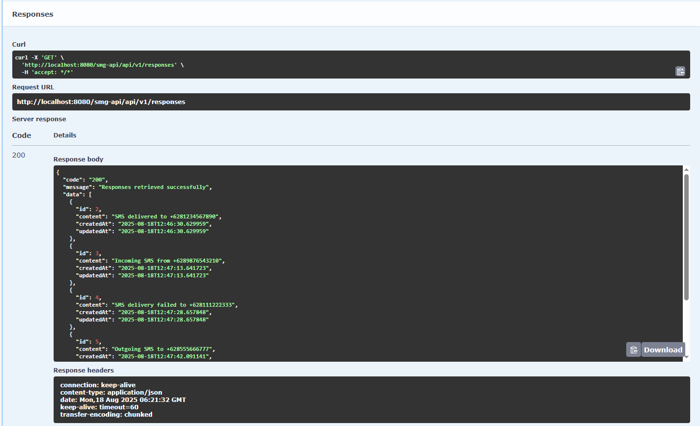
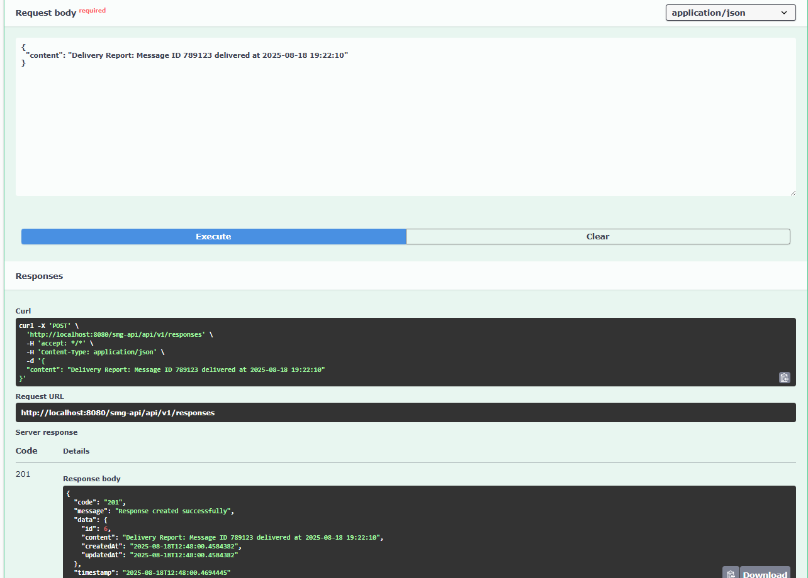
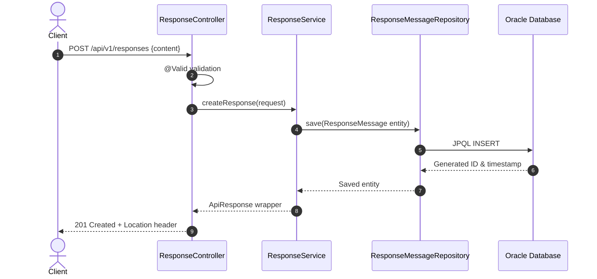

# SMIG-SMG ReceiveResponseWEB MVP

**Version**: 1.0.0-MVP  
**Spring Boot**: 3.3.3  
**Java**: 17  
**Database**: Oracle (dengan persiapan migrasi ke PostgreSQL)

## 📋 Overview

Aplikasi REST API MVP untuk menerima dan menyimpan response message ke Oracle Database. Aplikasi ini dibangun mengikuti SMIG Development Guide dengan fokus pada core functionality POST dan GET API, menggunakan Spring Boot 3.3.3 dengan arsitektur yang siap untuk migrasi database masa depan.

## 🎯 MVP Scope

Versi MVP ini mencakup fitur-fitur core:

- ✅ POST API untuk membuat response message
- ✅ GET API untuk mengambil semua response messages
- ✅ GET API untuk mengambil response message berdasarkan ID
- ✅ Global error handling
- ✅ Parameter validation menggunakan @Valid
- ✅ JPQL untuk database operations (siap migrasi PostgreSQL)
- ✅ Structured logging dengan Logback
- ✅ API documentation dengan Swagger
- ✅ Unit testing dengan JUnit 5

## Visuals

### Swagger GET TEST



### Swagger POST TEST



## 🏗️ Arsitektur



## 🛠️ Tech Stack

### Core Technologies

- **Framework**: Spring Boot 3.3.3
- **Java Version**: 17
- **Build Tool**: Maven 3.9+
- **Database**: Oracle Database (XE/Free 21c+)
- **Migration Tool**: Flyway

### Dependencies

- **Spring Boot Starters**: Web, Data JPA, Validation
- **Database**: Oracle JDBC Driver
- **Documentation**: SpringDoc OpenAPI (Swagger)
- **Logging**: Logback (default Spring Boot)
- **Testing**: JUnit 5, Mockito, TestContainers
- **Code Quality**: Lombok

## 📁 Project Structure

```
src/
├── main/
│   ├── java/com/smig/smg/receiver/
│   │   ├── ReceiveResponseWebApplication.java
│   │   ├── config/
│   │   │   ├── SwaggerConfig.java
│   │   │   └── DatabaseConfig.java
│   │   ├── controller/
│   │   │   └── ResponseController.java
│   │   ├── service/
│   │   │   ├── ResponseService.java
│   │   │   └── impl/ResponseServiceImpl.java
│   │   ├── repository/
│   │   │   └── ResponseMessageRepository.java
│   │   ├── entity/
│   │   │   └── ResponseMessage.java
│   │   ├── dto/
│   │   │   ├── request/CreateResponseRequest.java
│   │   │   ├── response/ResponseMessageDto.java
│   │   │   └── common/ApiResponse.java
│   │   ├── exception/
│   │   │   ├── SmgApiException.java
│   │   │   └── GlobalExceptionHandler.java
│   │   └── util/
│   │       └── Constants.java
│   └── resources/
│       ├── application.yml
│       ├── application-dev.yml
│       ├── application-test.yml
│       ├── application-prod.yml
│       └── db/migration/
│           └── V1__init_response_message.sql
└── test/
    ├── java/com/smig/smg/receiver/
    │   ├── controller/ResponseControllerTest.java
    │   ├── service/ResponseServiceTest.java
    │   └── repository/ResponseMessageRepositoryTest.java
    └── resources/
        └── application-test.yml
```

## 🔧 Configuration

### Database Configuration

**application.yml**

```yaml
spring:
  application:
    name: smig-smg-receive-response-web
  profiles:
    active: ${SPRING_PROFILES_ACTIVE:dev}

  # JPA Configuration
  jpa:
    open-in-view: false
    hibernate:
      ddl-auto: validate
    properties:
      hibernate:
        dialect: org.hibernate.dialect.OracleDialect
        format_sql: true
        jdbc.time_zone: UTC
    show-sql: false

  # Flyway Configuration
  flyway:
    enabled: true
    locations: classpath:db/migration
    baseline-on-migrate: true
    placeholders:
      schema: ${DATABASE_SCHEMA:SMG_APP}

# Server Configuration
server:
  port: ${SERVER_PORT:8080}
  servlet:
    context-path: /smg-api

# Logging Configuration
logging:
  level:
    com.smig.smg.receiver: INFO
    org.hibernate.SQL: INFO
  pattern:
    console: "%d{yyyy-MM-dd HH:mm:ss} - %msg%n"
    file: "%d{yyyy-MM-dd HH:mm:ss} [%thread] %-5level %logger{36} - %msg%n"

# API Documentation
springdoc:
  api-docs:
    path: /api-docs
  swagger-ui:
    path: /swagger-ui.html
```

**application-dev.yml**

```yaml
spring:
  datasource:
    url: ${DATABASE_URL:jdbc:oracle:thin:@localhost:1521/XEPDB1}
    username: ${DATABASE_USERNAME:smg_app}
    password: ${DATABASE_PASSWORD:smg_password}
    driver-class-name: oracle.jdbc.OracleDriver
    hikari:
      maximum-pool-size: 10
      minimum-idle: 2
      connection-timeout: 30000

logging:
  level:
    org.hibernate.SQL: DEBUG
    org.hibernate.type.descriptor.sql.BasicBinder: TRACE
```

## 📊 Database Schema

**Flyway Migration: V1\_\_init_response_message.sql**

```sql
-- Create sequence for response message IDs
CREATE SEQUENCE RESP_SEQ
START WITH 1
INCREMENT BY 1
NOCACHE
NOCYCLE;

-- Create main table
CREATE TABLE RESPONSE_MESSAGE (
    ID NUMBER(19) PRIMARY KEY,
    CONTENT VARCHAR2(4000) NOT NULL,
    CREATED_AT TIMESTAMP DEFAULT CURRENT_TIMESTAMP NOT NULL,
    UPDATED_AT TIMESTAMP DEFAULT CURRENT_TIMESTAMP NOT NULL
);

-- Create index for performance
CREATE INDEX IDX_RESPONSE_MESSAGE_CREATED_AT
ON RESPONSE_MESSAGE (CREATED_AT);

-- Create trigger for updated_at
CREATE OR REPLACE TRIGGER TRG_RESPONSE_MESSAGE_UPDATED_AT
    BEFORE UPDATE ON RESPONSE_MESSAGE
    FOR EACH ROW
BEGIN
    :NEW.UPDATED_AT := CURRENT_TIMESTAMP;
END;
/
```

## 🌐 API Endpoints

### Base URL

```
Development: http://localhost:8080/smg-api
Production: https://your-domain.com/smg-api
```

### 1. Create Response Message

```http
POST /api/v1/responses
Content-Type: application/json

{
  "content": "Sample response message content"
}
```

**Response (201 Created):**

```json
{
  "code": "200",
  "message": "Response created successfully",
  "data": {
    "id": 1,
    "content": "Sample response message content",
    "createdAt": "2025-08-18T12:34:56",
    "updatedAt": "2025-08-18T12:34:56"
  },
  "timestamp": "2025-08-18T12:34:56"
}
```

### 2. Get All Response Messages

```http
GET /api/v1/responses
```

**Response (200 OK):**

```json
{
  "code": "200",
  "message": "Responses retrieved successfully",
  "data": [
    {
      "id": 1,
      "content": "Sample response message content",
      "createdAt": "2025-08-18T12:34:56",
      "updatedAt": "2025-08-18T12:34:56"
    }
  ],
  "timestamp": "2025-08-18T12:34:56"
}
```

### 3. Get Response Message by ID

```http
GET /api/v1/responses/{id}
```

**Response (200 OK):**

```json
{
  "code": "200",
  "message": "Response retrieved successfully",
  "data": {
    "id": 1,
    "content": "Sample response message content",
    "createdAt": "2025-08-18T12:34:56",
    "updatedAt": "2025-08-18T12:34:56"
  },
  "timestamp": "2025-08-18T12:34:56"
}
```

### Error Response Format

```json
{
  "code": "404",
  "message": "Response message not found",
  "data": null,
  "timestamp": "2025-08-18T12:34:56"
}
```

## 🚀 Quick Start

### Prerequisites

- JDK 17+
- Maven 3.9+
- Oracle Database (XE 21c+ or Free 23c+)
- Git

### 1. Clone Repository

```bash
git clone <repository-url>
cd smig-smg-receive-response-web-mvp
```

### 2. Database Setup

```sql
-- Connect as SYSTEM or privileged user
CREATE USER smg_app IDENTIFIED BY smg_password;
GRANT CONNECT, RESOURCE TO smg_app;
GRANT UNLIMITED TABLESPACE TO smg_app;

-- Grant additional privileges for sequences
GRANT CREATE SEQUENCE TO smg_app;
GRANT CREATE TRIGGER TO smg_app;
```

### 3. Environment Configuration

```bash
# Set environment variables
export DATABASE_URL=jdbc:oracle:thin:@localhost:1521/XEPDB1
export DATABASE_USERNAME=smg_app
export DATABASE_PASSWORD=smg_password
export SPRING_PROFILES_ACTIVE=dev
```

### 4. Build and Run

```bash
# Clean and package
mvn clean package -DskipTests

# Run application
mvn spring-boot:run

# Or run JAR directly
java -jar target/smig-smg-receive-response-web-1.0.0-SNAPSHOT.jar
```

### 5. Verify Installation

```bash
# Health check
curl http://localhost:8080/smg-api/actuator/health

# Test POST API
curl -X POST http://localhost:8080/smg-api/api/v1/responses \
  -H "Content-Type: application/json" \
  -d '{"content":"Hello SMIG MVP!"}'

# Test GET API
curl http://localhost:8080/smg-api/api/v1/responses
```

### 6. Access Swagger UI

Open browser: `http://localhost:8080/smg-api/swagger-ui.html`

## 🧪 Testing

### Run Unit Tests

```bash
# Run all tests
mvn test

# Run specific test class
mvn test -Dtest=ResponseControllerTest

# Run with coverage
mvn test jacoco:report
```

### Test Coverage Target

- **Minimum**: 80% line coverage
- **Target**: 90% line coverage
- **Focus**: Service layer and Controller layer

### Sample Test Structure

```java
@ExtendWith(MockitoExtension.class)
class ResponseServiceTest {

    @Mock
    private ResponseMessageRepository repository;

    @InjectMocks
    private ResponseServiceImpl responseService;

    @Test
    @DisplayName("Should create response message successfully")
    void shouldCreateResponseMessageSuccessfully() {
        // AAA Pattern: Arrange-Act-Assert
        // Test implementation
    }
}
```

## 📦 Build and Deployment

### Maven Build

```bash
# Development build
mvn clean compile

# Production build
mvn clean package -Pprod -DskipTests

# Build with tests
mvn clean package
```

### Docker Support (Future)

```dockerfile
FROM openjdk:17-jre-slim
VOLUME /tmp
COPY target/smig-smg-receive-response-web-1.0.0-SNAPSHOT.jar app.jar
ENTRYPOINT ["java","-jar","/app.jar"]
```

### Environment-specific Deployment

```bash
# Development
java -jar app.jar --spring.profiles.active=dev

# Testing
java -jar app.jar --spring.profiles.active=test

# Production
java -jar app.jar --spring.profiles.active=prod \
  --server.port=8080 \
  --spring.datasource.url=$DATABASE_URL \
  --spring.datasource.username=$DATABASE_USERNAME \
  --spring.datasource.password=$DATABASE_PASSWORD
```

## 🔍 Code Quality

### SonarQube Integration (Future)

```bash
# Run SonarQube analysis (when available)
mvn sonar:sonar
```

### Code Style

- **Lombok**: Consistent usage for cleaner code
- **Naming**: CamelCase for variables, UPPER_SNAKE_CASE for constants
- **Validation**: @Valid annotations for all request DTOs
- **Logging**: SLF4J with Logback, no System.out.print

### Static Analysis

```bash
# SpotBugs (when configured)
mvn spotbugs:check

# Checkstyle (when configured)
mvn checkstyle:check
```

## 🔒 Security Considerations (Future Enhancement)

Untuk versi production, akan ditambahkan:

- Spring Security dengan JWT authentication
- AES256 encryption untuk sensitive data
- HTTPS enforcement
- CORS configuration
- SQL injection protection via JPQL

## 📚 Database Migration Preparation

### JPQL Usage

Aplikasi ini sudah menggunakan JPQL untuk semua database operations:

```java
@Repository
public interface ResponseMessageRepository extends JpaRepository<ResponseMessage, Long> {

    @Query("SELECT r FROM ResponseMessage r WHERE r.createdAt >= :startDate ORDER BY r.createdAt DESC")
    List<ResponseMessage> findRecentResponses(@Param("startDate") LocalDateTime startDate);

    @Query("SELECT COUNT(r) FROM ResponseMessage r WHERE r.createdAt BETWEEN :start AND :end")
    long countResponsesInPeriod(@Param("start") LocalDateTime start, @Param("end") LocalDateTime end);
}
```

### Migration Ready

- ✅ Tidak ada native SQL queries
- ✅ Menggunakan standard JPA annotations
- ✅ Hibernate dialect dapat diganti
- ✅ JPQL queries database-agnostic

## 🐛 Troubleshooting

### Common Issues

**1. Oracle Connection Failed**

```bash
# Check Oracle listener
lsnrctl status

# Test connection
sqlplus smg_app/smg_password@localhost:1521/XEPDB1
```

**2. Flyway Migration Error**

```bash
# Reset Flyway (development only)
mvn flyway:clean flyway:migrate

# Check migration status
mvn flyway:info
```

**3. Port Already in Use**

```bash
# Find process using port 8080
netstat -tlnp | grep :8080

# Kill process
kill -9 <process-id>

# Or use different port
--server.port=8081
```

**4. JPA Schema Validation Failed**

```sql
-- Verify schema exists
SELECT table_name FROM user_tables WHERE table_name = 'RESPONSE_MESSAGE';

-- Check sequence
SELECT sequence_name FROM user_sequences WHERE sequence_name = 'RESP_SEQ';
```

## 📈 Future Enhancements (Post-MVP)

### Phase 2 Features

- [ ] Authentication & Authorization (Spring Security + JWT)
- [ ] Request/Response encryption (AES256)
- [ ] Audit logging
- [ ] Pagination & sorting
- [ ] Advanced search capabilities

### Phase 3 Features

- [ ] PostgreSQL migration
- [ ] Containerization (Docker)
- [ ] CI/CD pipeline
- [ ] Performance monitoring
- [ ] Caching layer (Redis)

### Code Quality Improvements

- [ ] SonarQube integration
- [ ] Automated code review
- [ ] Performance testing
- [ ] Security scanning

## 🤝 Contributing

### Development Workflow

1. Create feature branch from `develop`
2. Follow coding standards and naming conventions
3. Write unit tests (minimum 80% coverage)
4. Update documentation if needed
5. Submit pull request with descriptive title

### Code Review Checklist

- [ ] JPQL usage (no native SQL)
- [ ] Proper exception handling
- [ ] Lombok annotations used appropriately
- [ ] @Valid annotations for request DTOs
- [ ] Logging with SLF4J (no System.out.print)
- [ ] Unit tests written and passing
- [ ] API documentation updated

## 📝 Changelog

### Version 1.0.0-MVP (Current)

- Initial MVP release
- Core POST/GET API functionality
- Oracle database integration with Flyway
- JPQL-ready for database migration
- Global error handling
- API documentation with Swagger
- Unit testing framework setup

---

**Maintainer**: T0MM11Y  
**Last Updated**: August 2025  
**License**: Proprietary

## 📞 Support

For technical support or questions:

- Create an issue in the project repository
- Contact: SMIG Development Team
- Documentation: Check Swagger UI at `/swagger-ui.html`
